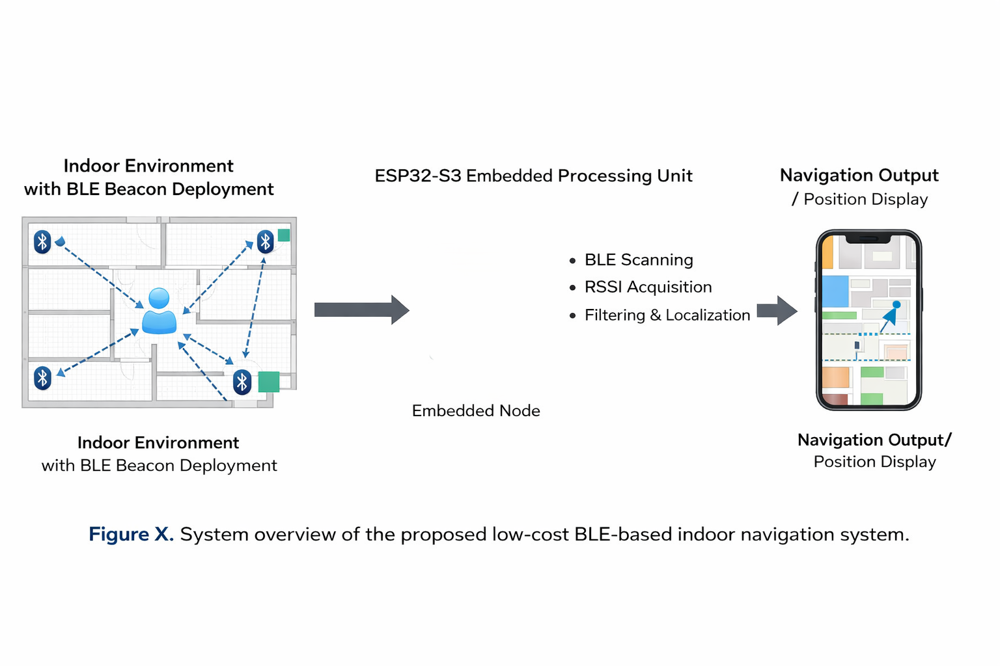
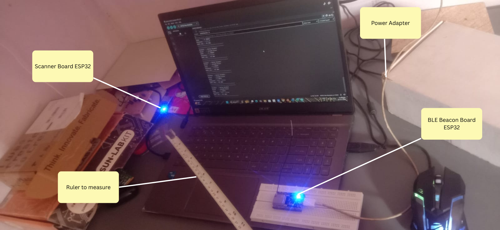
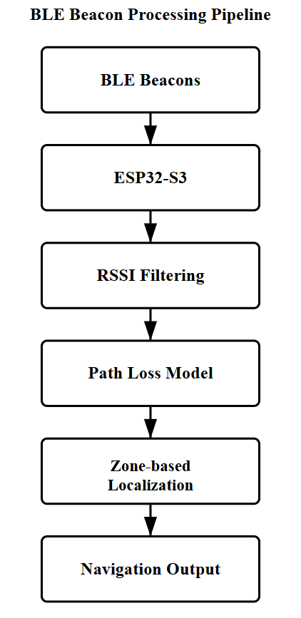
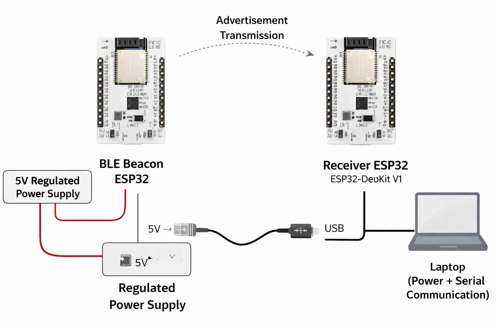
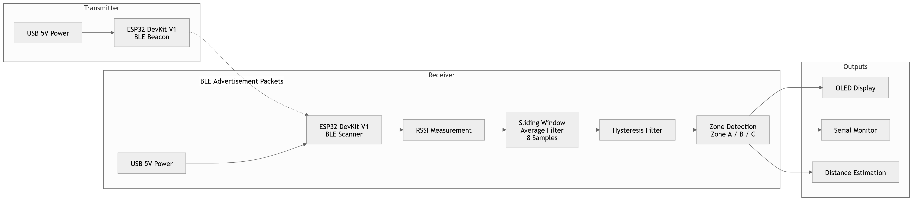
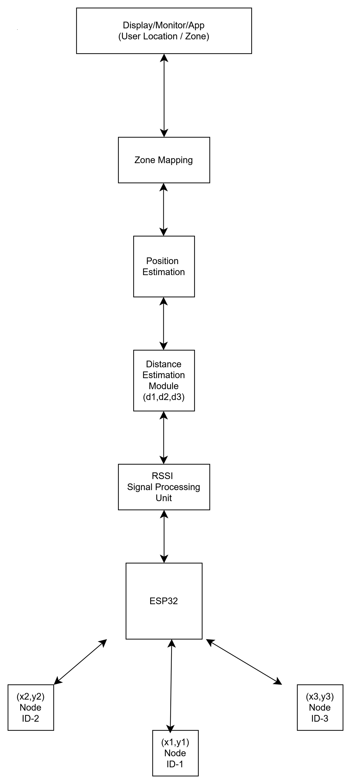
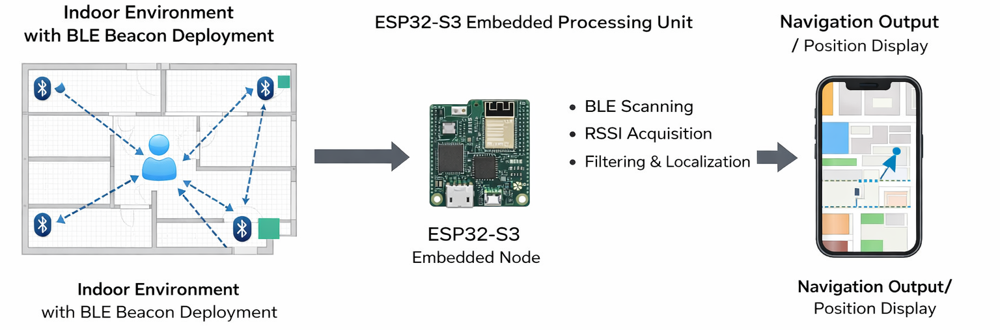
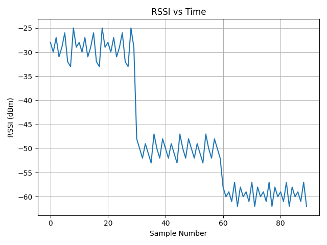
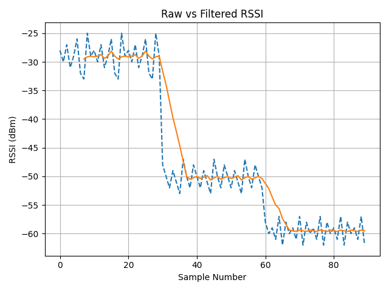
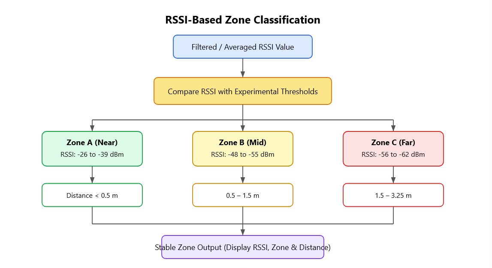

<div align="center">

# 🚀 BLE-Based Indoor Positioning System using ESP32

### Design and Implementation of a Zone-Based BLE Indoor Localization System using ESP32

*A low-cost, real-time Bluetooth Low Energy (BLE) indoor positioning system that estimates user location using RSSI-based zone detection with signal filtering and hysteresis validation.*



---


</div>

---

# 📖 Project Overview

Indoor positioning has become an essential requirement in environments where GPS signals are unavailable or unreliable, such as shopping malls, warehouses, hospitals, airports, museums, smart factories, and educational institutions.

This project presents a **low-cost BLE-based Indoor Positioning System** implemented using **ESP32** development boards. The system continuously scans Bluetooth Low Energy (BLE) advertisement packets transmitted by nearby beacon nodes and estimates the user's proximity using the **Received Signal Strength Indicator (RSSI)**.

Since RSSI measurements fluctuate significantly due to environmental noise, signal attenuation, and multipath propagation, the system applies a **Sliding Window Averaging Filter** followed by **Hysteresis Validation** to stabilize measurements before determining the user's location.

Instead of estimating exact coordinates, the system classifies the user into predefined proximity zones:

- 🟢 Zone A (Near)
- 🟡 Zone B (Mid)
- 🔴 Zone C (Far)

The detected zone, estimated distance range, floor information, and RSSI value are displayed in real time through the ESP32 Serial Monitor (and optionally on an OLED display).

The proposed system performs all computations directly on the ESP32 edge device, eliminating the need for cloud processing or extensive calibration while maintaining reliable localization performance.

---

# 📑 Table of Contents

- [Project Overview](#-project-overview)
- [Features](#-features)
- [Hardware Setup](#-hardware-setup)
- [System Architecture](#-system-architecture)
- [Block Diagram](#-block-diagram)
- [Circuit Diagram](#-circuit-diagram)
- [System Flowchart](#-system-flowchart)
- Working Principle
- BLE Communication
- RSSI Processing
- Sliding Window Filtering
- Hysteresis Validation
- Zone Detection
- Distance Estimation
- Experimental Setup
- Experimental Results
- RSSI Analysis
- Zone Classification
- Performance Evaluation
- Future Improvements
- References

---

# ✨ Features

## Core Features

- Bluetooth Low Energy (BLE) based Indoor Localization
- ESP32-Based Edge Processing
- RSSI Signal Acquisition
- Sliding Window RSSI Averaging
- Hysteresis-Based Zone Stabilization
- Real-Time Zone Detection
- Distance Range Estimation
- Low Hardware Cost
- Easy Deployment
- Low Power BLE Communication

---

## Functional Features

✔ BLE Advertisement Scanning

✔ RSSI Measurement

✔ RSSI Noise Reduction

✔ Dynamic Zone Classification

✔ Stable Zone Detection

✔ Real-Time Monitoring

✔ Product Information Display

✔ Floor Identification

✔ Distance Estimation

✔ Continuous BLE Scanning

---

## Advantages

- Low-cost implementation
- Simple deployment
- No internet connectivity required
- Fully edge-based processing
- Real-time localization
- Minimal hardware requirements
- Easily scalable for indoor environments

---

# 🔧 Hardware Setup

The experimental setup consists of two ESP32 development boards operating as a BLE Beacon and BLE Scanner respectively.

The BLE Beacon continuously transmits advertisement packets, while the Scanner receives these packets and estimates the user's location using RSSI measurements.

<div align="center">



**Figure 1. Experimental Hardware Setup**

</div>

### Hardware Components

|          Component        | Quantity |        Purpose       |
|---------------------------|----------|----------------------|
| ESP32 DevKit V1           | 2        | BLE Beacon & Scanner |
| USB Power Adapter         | 2        | Power Supply         |
| Breadboard                | 1        | Prototype Setup      |
| BLE Advertisement         | 1        | Beacon Broadcasting  |
| Laptop                    | 1        | Serial Monitoring    |
| Measuring Scale           | 1        | Distance Measurement |

---

# 🏗 System Architecture

The complete system consists of a BLE Beacon transmitter and an ESP32 receiver.

The transmitter periodically broadcasts BLE advertisement packets. The receiver continuously scans for these packets, extracts RSSI values, filters the measurements, estimates the user's proximity, and displays the detected zone.

<div align="center">



**Figure 2. Overall System Architecture**

</div>

---

# 📦 Block Diagram

The following block diagram illustrates the complete BLE localization processing pipeline.

The RSSI values received from BLE Beacons are filtered before estimating the user's location. The processed information is then converted into meaningful navigation outputs.

<div align="center">



**Figure 3. BLE Localization Processing Pipeline**

</div>

---

# 🔌 Circuit Diagram

The hardware consists of a BLE Beacon (ESP32) and a BLE Scanner (ESP32).

The Beacon periodically advertises BLE packets while the Scanner receives these packets for RSSI analysis.

<div align="center">



**Figure 4. Hardware Connection Diagram**

</div>

---

# 🔄 System Flowchart

The following flowchart illustrates the complete software execution sequence implemented in the ESP32 receiver.

The firmware continuously scans BLE advertisements, acquires RSSI values, applies filtering, validates stable zone transitions using hysteresis, estimates the distance range, and finally displays the detected location.

<div align="center">



**Figure 5. Software Flowchart**

</div>

---

# 📌 Summary

The proposed system combines BLE communication, RSSI signal processing, sliding window filtering, and hysteresis validation to provide a simple, reliable, and low-cost indoor localization solution.

The following sections describe each processing stage in detail, including BLE communication, RSSI acquisition, signal filtering, distance estimation, experimental analysis, and performance evaluation.

---


# ⚙️ Working Principle

The proposed Indoor Positioning System operates using Bluetooth Low Energy (BLE) communication between an ESP32 Beacon (Transmitter) and an ESP32 Receiver (Scanner).

The beacon periodically broadcasts BLE advertisement packets containing a unique UUID. The receiver continuously scans for these advertisement packets and measures the Received Signal Strength Indicator (RSSI).

Since RSSI values fluctuate due to environmental noise, obstacles, and multipath propagation, the raw measurements are processed using a Sliding Window Averaging Filter followed by Hysteresis Validation before estimating the user's location.

Finally, the processed RSSI value is compared with experimentally determined threshold values to classify the receiver into one of three predefined proximity zones.

<div align="center">

| Processing Pipeline |
|:-------------------:|
| **BLE Advertisement → RSSI Acquisition → Sliding Window Filter → Hysteresis Validation → Zone Classification → Distance Estimation → Display Output** |

</div>

---

# 📡 BLE Communication

Bluetooth Low Energy (BLE) is a short-range wireless communication protocol operating in the **2.4 GHz ISM band**. It provides low power consumption while maintaining reliable wireless communication, making it suitable for indoor localization applications.

In this project, one ESP32 functions as a BLE Beacon (Transmitter), periodically broadcasting advertisement packets, while another ESP32 continuously scans these packets to estimate proximity based on RSSI.

## BLE Beacon

The Beacon performs the following tasks:

- Initializes BLE stack
- Creates advertisement packets
- Broadcasts UUID
- Advertises continuously
- Maintains constant transmission power

### Advertisement Parameters
 
|      Parameter      |             Value          |
|---------------------|----------------------------|
| Protocol            | Bluetooth Low Energy (BLE) |
| UUID                | Custom UUID                |
| Advertisement Mode  | Continuous                 |
| Scan Interval       | 2 Seconds                  |
| Manufacturer ID     | Apple iBeacon Format       |
| TX Power            | -59 dBm                    |

---

# 📶 RSSI Acquisition

RSSI (Received Signal Strength Indicator) represents the received signal strength of the BLE advertisement packets.

As the receiver moves away from the beacon, the RSSI value decreases.

```
Near Beacon
RSSI ≈ -28 dBm

↓

Medium Distance
RSSI ≈ -50 dBm

↓

Far Distance
RSSI ≈ -60 dBm
```

Typical factors affecting RSSI include:

- Distance
- Obstacles
- Human movement
- Multipath reflections
- Environmental interference

These variations make raw RSSI measurements unstable for direct localization.

---

# 📊 RSSI Processing

The ESP32 receiver continuously measures RSSI values from incoming BLE advertisements.

Each received packet contributes one RSSI sample.

Example:

| Sample  | RSSI (dBm) |
|---------|-----------:|
| 1       | -44        |
| 2       | -46        |
| 3       | -43        |
| 4       | -49        |
| 5       | -45        |
| 6       | -47        |
| 7       | -46        |
| 8       | -44        |

Instead of directly using one RSSI measurement, the system applies filtering to improve localization stability.

---

# 📉 Sliding Window Averaging Filter

RSSI values fluctuate significantly even when the receiver remains stationary.

To reduce random noise, a **Sliding Window Average Filter** is applied.

The receiver stores the most recent **8 RSSI samples**.

The filtered RSSI is computed as:

\[
RSSI_{avg}=\frac{RSSI_1+RSSI_2+\cdots+RSSI_8}{8}
\]

where

- Window Size = 8 Samples
- Scan Duration = 2 Seconds

## Benefits

- Reduces random fluctuations
- Produces smoother RSSI curves
- Improves localization stability
- Increases zone detection accuracy


**Figure 6. Raw RSSI vs Filtered RSSI**

</div>

---

# 🔄 Hysteresis Validation

Even after filtering, RSSI values may oscillate near zone boundaries.

To prevent rapid switching between adjacent zones, a **Hysteresis Validation** mechanism is implemented.

A new zone is accepted only after receiving multiple consecutive confirmations.

### Example

```
Current Zone

↓

Zone A

↓

RSSI briefly enters Zone B

↓

Ignore

↓

Zone A remains stable

↓

RSSI consistently enters Zone B

↓

Zone changes to Zone B
```

This significantly improves system stability during user movement.

### Advantages

- Prevents false zone transitions
- Eliminates flickering outputs
- Improves navigation reliability
- Produces smoother localization

---

# 📍 Zone Classification

The filtered RSSI value is compared against experimentally determined thresholds to estimate the receiver's location.

|    Zone    |     RSSI Range    | Estimated Distance |
|------------|-------------------|--------------------|
| 🟢 Zone A | -26 dBm to -39 dBm | Less than 0.5 m    |
| 🟡 Zone B | -48 dBm to -55 dBm | 0.5 – 1.5 m        |
| 🔴 Zone C | -56 dBm to -62 dBm | 1.5 – 3.25 m       |


**Figure 7. RSSI-Based Zone Classification**

</div>

---

# 📏 Distance Estimation

Rather than calculating an exact coordinate position, the proposed system estimates the receiver's proximity using predefined RSSI thresholds.

This approach reduces computational complexity while maintaining practical localization performance.

|  Zone  |    Distance   |
|--------|---------------|
| Zone A |    < 0.5 m    |
| Zone B |   0.5 – 1.5 m |
| Zone C | 1.5 – 3.25 m  |

The estimated distance is displayed together with the detected zone.

---

# 🖥️ Output Generation

After RSSI processing and zone classification, the ESP32 generates real-time localization information.

The output contains:

- Product Name
- Floor Name
- Zone
- Estimated Distance
- RSSI Value

Example Output

```text
--------------------------------
Product Name : Dairy Product

Floor Name   : Ground Floor

Zone         : Zone B

Distance     : 0.5 – 1.5 m

RSSI Avg     : -51 dBm
--------------------------------
```

<div align="center">



**Figure 8. Experimental Serial Monitor Output**

</div>

---

# ✅ Key Contributions

The proposed BLE Indoor Positioning System offers:

- Low-cost indoor localization using ESP32
- Real-time BLE scanning
- RSSI-based proximity estimation
- Sliding Window RSSI Filtering
- Hysteresis-based zone stabilization
- Edge computing without cloud dependency
- Low computational complexity
- Reliable zone detection for indoor environments

The following section presents the experimental setup, RSSI analysis, performance evaluation, and comparison with existing localization methods.

# 🧪 Experimental Setup

The BLE Indoor Positioning System was experimentally evaluated in an indoor environment using two ESP32 development boards configured as a BLE Beacon (Transmitter) and BLE Scanner (Receiver).

The receiver was moved to different locations relative to the beacon while continuously collecting RSSI values. Multiple observations were recorded for each zone to evaluate the effectiveness of the proposed RSSI filtering algorithm and zone classification technique. :contentReference[oaicite:1]{index=1}

<div align="center">


**Figure 9. Experimental Hardware Setup**

</div>

---

# 📐 Experimental Configuration

| Parameter | Value |
|-----------|-------|
| Microcontroller | ESP32 DevKit V1 |
| Communication Protocol | Bluetooth Low Energy (BLE) |
| Beacon Type | BLE Advertisement |
| RSSI Window Size | 8 Samples |
| BLE Scan Duration | 2 Seconds |
| Localization Technique | RSSI-Based Zone Detection |
| Filtering Method | Sliding Window Averaging |
| Zone Stabilization | Hysteresis Validation |

---

# 📡 RSSI Signal Behaviour

The RSSI values were continuously recorded while moving the receiver between different zones relative to the BLE beacon.

The experimental observations show that:

- Near the beacon, RSSI values remained approximately **−25 dBm to −30 dBm**.
- As the receiver moved farther away, RSSI decreased to around **−50 dBm**.
- At larger distances, RSSI dropped below **−60 dBm**, indicating the far zone. :contentReference[oaicite:2]{index=2}

<div align="center">



**Figure 10. RSSI Variation During Movement**

</div>

---

# 📉 RSSI Filtering Analysis

Raw RSSI measurements fluctuate because of environmental noise, obstacles, and multipath reflections.

To improve localization stability, a Sliding Window Averaging Filter was applied before zone classification.

The filtered RSSI curve exhibits smoother transitions between zones, reducing rapid fluctuations and improving the reliability of localization. :contentReference[oaicite:3]{index=3}

<div align="center">



**Figure 11. Raw RSSI vs Filtered RSSI**

</div>

---

# 📍 RSSI-Based Zone Classification

Based on the experimental observations, three proximity zones were defined.

| Zone | RSSI Range | Estimated Distance |
|------|------------|-------------------|
| 🟢 Zone A | −26 to −39 dBm | < 0.5 m |
| 🟡 Zone B | −48 to −55 dBm | 0.5 – 1.5 m |
| 🔴 Zone C | −56 to −62 dBm | 1.5 – 3.25 m |

These threshold values were obtained experimentally using multiple RSSI measurements. :contentReference[oaicite:4]{index=4}

<div align="center">



**Figure 12. RSSI-Based Zone Classification**

</div>

---

# 📊 Zone Detection Accuracy

To evaluate the effectiveness of RSSI filtering, localization accuracy was compared before and after applying the Sliding Window Averaging Filter.

| Zone | Before Filtering | After Filtering |
|------|-----------------:|----------------:|
| 🟢 Zone A (Near) | 78% | **93%** |
| 🟡 Zone B (Mid) | 74% | **91%** |
| 🔴 Zone C (Far) | 71% | **89%** |

The filtering algorithm significantly improved localization performance across all three proximity zones. :contentReference[oaicite:5]{index=5}

---

# 📈 Accuracy Comparison

<div align="center">


**Figure 13. Zone Detection Accuracy Before and After Filtering**

</div>

---

# ⚖️ Comparison with Existing Localization Methods

The proposed BLE localization approach was compared with common indoor positioning techniques.

| Method | Calibration | Cloud Required | Cost | Complexity |
|---------|-------------|----------------|------|-----------|
| Fingerprinting | High | No | Medium | High |
| Trilateration | Medium | No | Medium | Medium |
| Cloud-Based BLE | Medium | Yes | High | High |
| **Proposed System** | **Low** | **No** | **Low** | **Low** |

Unlike fingerprinting or cloud-based localization systems, the proposed solution performs localization directly on the ESP32 edge device, reducing complexity while maintaining reliable performance. :contentReference[oaicite:6]{index=6}

---

# 🖥️ Representative System Outputs

During experimentation, the ESP32 receiver successfully displayed:

- Product Name
- Floor Location
- Detected Zone
- Estimated Distance
- Average RSSI Value

These outputs were generated in real time after RSSI filtering and zone classification. :contentReference[oaicite:7]{index=7}

---

# 🚀 Experimental Serial Monitor Outputs

## System Initialization

<div align="center">


**Figure 14. System Initialization**

</div>

---

## Near Zone Detection

<div align="center">


**Figure 15. Near Zone Detection**

</div>

---

## Mid Zone Detection

<div align="center">


**Figure 16. Mid Zone Detection**

</div>

---

## Far Zone Detection

<div align="center">


**Figure 17. Far Zone Detection**

</div>

---

## Zone Transition Detection

<div align="center">


**Figure 18. Zone Transition Detection**

</div>

---

## Mid-to-Far Zone Transition

<div align="center">


**Figure 19. Mid-to-Far Zone Transition**

</div>

---

# 💡 Experimental Observations

The experimental evaluation demonstrates that:

- RSSI decreases as the receiver moves away from the BLE beacon.
- Sliding Window Averaging significantly reduces RSSI fluctuations.
- Hysteresis validation prevents unstable zone switching near threshold boundaries.
- The experimentally derived RSSI thresholds enable consistent classification into Near, Mid, and Far zones.
- Real-time localization is achieved entirely on the ESP32 without requiring cloud processing or extensive calibration. :contentReference[oaicite:8]{index=8}

---

# ✅ Performance Summary

|          Metric        |           Result            |
|------------------------|-----------------------------|
| Communication Protocol | Bluetooth Low Energy (BLE)  |
| Localization Method    | RSSI-Based Zone Detection   |
| Processing             | On-Device (ESP32)           |
| Filtering              | Sliding Window Average      |
| Zone Stabilization     | Hysteresis Validation       |
| Localization Zones     | 3                           |
| Maximum Tested Distance| 3.25 m                      |
| Best Zone Accuracy     | 93%                         |
| Lowest Zone Accuracy   | 89%                         |

---

The next section describes the repository structure, firmware organization, build instructions, project execution, future improvements, references, and acknowledgements.

---

# 💻 Software Requirements

The project was developed using the following software tools.

|        Software      |         Version      |
|----------------------|----------------------|
| Arduino IDE          | 2.x                  |
| ESP32 Board Package  | Latest Stable        |
| C++                  | GNU GCC              |
| Draw.io              | Latest               |
| Git                  | Latest               |
| GitHub               | Repository Hosting   |

---

# 🔧 Hardware Requirements

|      Component     | Quantity |
|--------------------|----------|
| ESP32 DevKit V1    | 2        |
| BLE Beacon         | 1        |
| USB Cable          | 2        |
| Laptop/Desktop     | 1        |

---

## Open the Project

Open the project using Arduino IDE.

```
Firmware

├── beacon
│     beacon.ino
│
└── scanner
      scanner.ino
```

---

## Install ESP32 Board Package

Arduino IDE

```
File
    ↓
Preferences
    ↓
Additional Board Manager URLs

https://raw.githubusercontent.com/espressif/arduino-esp32/gh-pages/package_esp32_index.json
```

Install

```
ESP32 by Espressif Systems
```

---

# ⚡ Upload Firmware

## Beacon ESP32

Open

```
firmware/beacon/beacon.ino
```

Select

```
Board:
ESP32 Dev Module
```

Upload

---

## Scanner ESP32

Open

```
firmware/scanner/scanner.ino
```

Upload to second ESP32.

---

# ▶️ Running the Project

Power both ESP32 boards.

The Beacon immediately starts advertising BLE packets.

The Scanner continuously searches for nearby BLE devices.

Once a beacon is detected, the Scanner

- Reads RSSI
- Applies Sliding Window Averaging
- Performs Hysteresis Validation
- Determines Zone
- Estimates Distance
- Displays Output

---

# 🖥 Expected Output

```
------------------------------------

BLE Indoor Positioning System

Product Name : Dairy Product

Floor Name   : Ground Floor

Zone         : Zone B

Distance     : 0.5 – 1.5 m

RSSI         : -51 dBm

------------------------------------
```

---

# 📈 Performance Highlights

✔ Real-Time BLE Localization

✔ Low Hardware Cost

✔ Low Power Consumption

✔ RSSI Noise Filtering

✔ Stable Zone Detection

✔ Edge Computing

✔ No Internet Required

✔ Easy Deployment

---


# 📚 References

1. Bluetooth SIG — Bluetooth Low Energy (BLE) Specification

2. Espressif Systems — ESP32 Technical Reference Manual

3. ESP32 Arduino Documentation

4. Indoor Positioning using RSSI Techniques

5. Bluetooth Low Energy Indoor Localization Research Papers

---

# 🙏 Acknowledgements

This project was successfully completed as part of the Bachelor of Engineering (Electronics and Communication Engineering) Final Year Project.

Special thanks to

- Project Guide
- Department of Electronics and Communication Engineering
- Chennai Institute of Technology
- Espressif Systems
- Bluetooth SIG

for providing the necessary resources and technical references.

---

# 📜 License

This project is licensed under the **MIT License**.

See the LICENSE file for complete details.

---

# 👨‍💻 Author

## Siddharth

Bachelor of Engineering (ECE)

Embedded Systems | IoT | Firmware Development

GitHub:
https://github.com/yourusername

LinkedIn:
https://linkedin.com/in/yourprofile

Email:
yourmail@example.com

---

<div align="center">

## ⭐ If you found this project useful, please consider giving it a Star!

**Made with ❤️ using ESP32 and Bluetooth Low Energy**

</div>